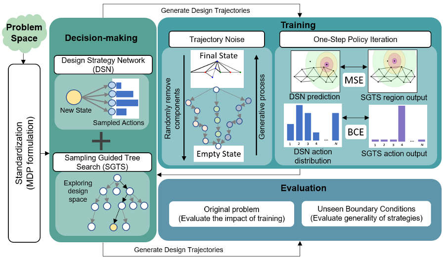

# SGTS (Sampling Guided Tree Search)
This repository provides the code used in the Self-Learning Design Agent [paper](). The repository builds upon Watch the Unobserved [paper](https://github.com/liuanji/WU-UCT) and makes several updates across files to enable application to complex actions spaces. Major updates are within policy architechture (Policy/ folder), root node initialization (Node/), and tree search component (Tree/). The policy network generates a prior distribution on feasible actions which intializes the tree nodes and guides the search in a pruned design space. The policy network architechture is based on Design Strategy Network([paper](https://asmedigitalcollection.asme.org/mechanicaldesign/article/144/2/021404/1120713/Design-Strategy-Network-A-Deep-Hierarchical)) and an updated version of the architecturrer is provided identical to the one used in SLDA paper. This rerpository contains the decision making framework of the given agent achitecture.  

# Usage
This repository provides code snippets for future usage. Although the code is not functional as it is, these snippets of tree search can be applied to new problems with complex action spaces. The structure for environment and policy classes are defined in environment and policy wrapper definitions respectively.

## Prerequisites
- Python 3.x
- PyTorch 1.0
- Numpy 1.17.2

## Running
1. Download or clone the repository.
2. Add environment in Env folder.
3. Edit Policy architecture as per environment requirements

* A full list of parameters
  * --model: MCTS model to use (currently only supports WU-UCT).
  * --env-name: name of the environment.
  * --MCTS-max-steps: number of simulation steps in the planning phase.
  * --MCTS-max-depth: maximum planning depth.
  * --MCTS-max-width: maximum width for each node.
  * --gamma: environment discount factor.
  * --expansion-worker-num: number of expansion workers.
  * --simulation-worker-num: number of simulation workers.
  * --seed: random seed for the environment.
  * --max-episode-length: a strict upper bound of environment's episode length.
  * --policy: TrussDSN (Untrained) or TrussDSNPre (Trained) or TrussDSNcomb (MT Trained)
  * --device: support "cpu", "cuda:x", and "cuda". If entered "cuda", it will use all available cuda devices. Usually used to load the policy.
  #additional parameters for truss
  * --scenario: Boundary condition
  * --trained: True or False
  * --repeat: Number of trajectories to generate

## Run on your own environments (identical to WU-UCT)
We kindly provide an [environment wrapper](https://github.com/liuanji/WU-UCT/tree/master/Env/EnvWrapper.py) and a [policy wrapper](https://github.com/liuanji/WU-UCT/tree/master/Policy/PolicyWrapper.py) to make easy extensions to other environments. All you need is to modify [./Env/EnvWrapper.py](https://github.com/liuanji/WU-UCT/tree/master/Env/EnvWrapper.py) and [./Policy/PolicyWrapper.py](https://github.com/liuanji/WU-UCT/tree/master/Policy/PolicyWrapper.py), and fit in your own environment. Please follow the below instructions.

1. Edit the class EnvWrapper in [./Env/EnvWrapper.py](https://github.com/liuanji/WU-UCT/tree/master/Env/EnvWrapper.py).

    Nest your environment into the wrapper by providing specific functionality in each of the member function of EnvWrapper. There are currently four input arguments to EnvWrapper: *env_name*, *max_episode_length*, *enable_record*, and *record_path*. If additional information needs to be imported, you may first consider adding them in *env_name*.

2. Edit the class PolicyWrapper in [./Policy/PolicyWrapper.py](https://github.com/liuanji/WU-UCT/tree/master/Policy/PolicyWrapper.py).

    Similarly, nest your default policy in PolicyWrapper, and pass the corresponding method using --policy. You will need to rewrite *get_action*, *get_value*, and *get_prior_prob* three member functions.

# Reference
Upcoming publication in IDETC ASME 2022 "Self Learning Design Agent (SLDA): Enabling design learning and tree search in complex action spaces" and submitted to Journal of Mechanical Design 2023 "Learning to design without prior data: Discovering generalizable design strategies using deep learning and tree search" 
